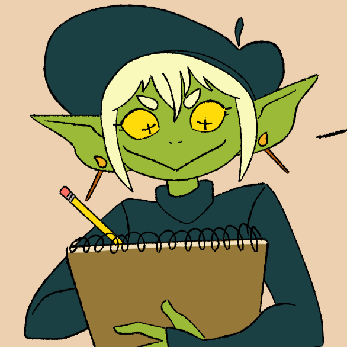

# Camilla Babb

I'm very excited to be learning with everyone here at Code:You! Outside of class I spend a lot of time drawing, crafting, and reading! My favorite genres are fantasy and mystery. I can't wait to learn more about the different coding languages!

### Hobbies

- Crochet
- Needle Felting
- Digital Art
- Painting
- Reading
- Playing cozy video games
    - Animal Crossing
    - Stardew Valley
    - Pokemon
- Practicing coding!

A link to my [art portfolio!](https://www.behance.net/camillababb)